# Asteroid Collision Alerting

An event-driven pipeline over NASA's open APIs, with a server-rendered front end.
**asteroid-service** reads five NASA APIs and publishes potentially hazardous close
approaches to Kafka; **notification-service** consumes those events, stores them and
emails subscribers; **web-ui** renders all of it — including what the pipeline itself
did.

Java 21 · Spring Boot 4.1 · Kafka · MySQL · Flyway · JSP · Testcontainers

📚 **[Teaching documentation](docs/README.md)** — twelve chapters, in
[English](docs/en/00-overview.md) and [Português](docs/pt-BR/00-overview.md).

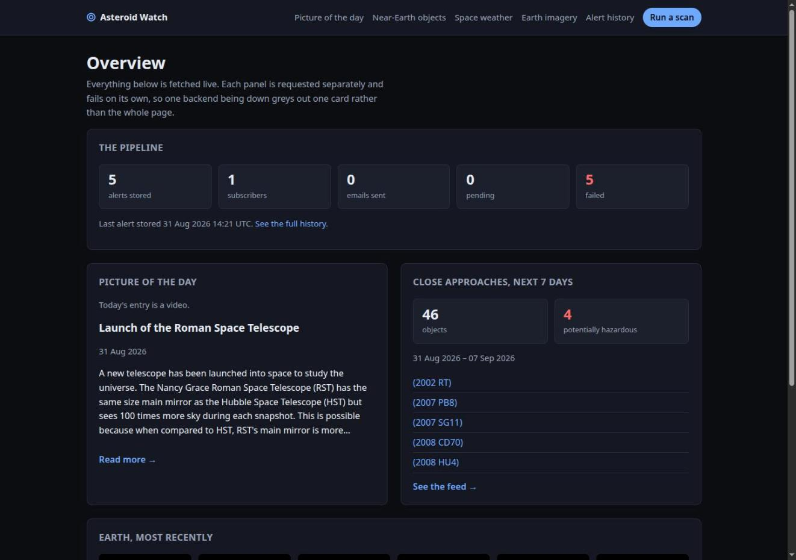

> *The dashboard at `localhost:8082`, live. Every panel is fetched separately and is
> allowed to fail on its own — stop `notification-service` and the pipeline card greys
> out while the NASA cards keep rendering. Note the picture of the day says "Today's
> entry is a video": APOD publishes video roughly one day a week, and on those days
> there is no image to show, so the page branches on `media_type` rather than
> rendering a broken ``.*

---

## Architecture

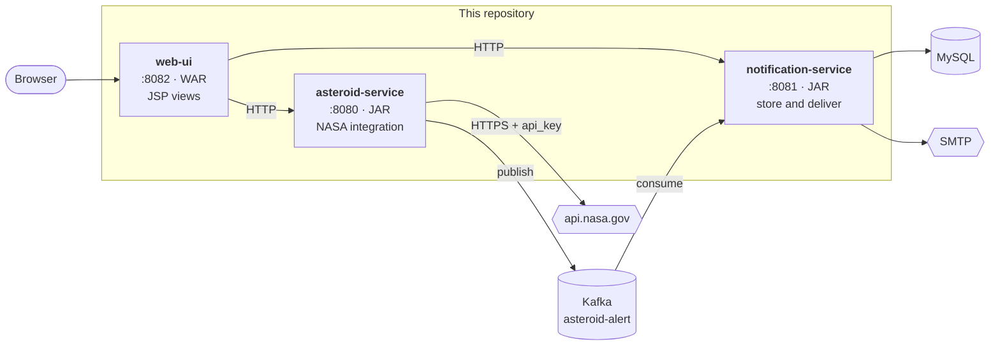

No arrow points backwards. `web-ui` reads the other two and neither knows it exists;
`asteroid-service` publishes to Kafka and does not know who consumes; `notification-service`
never calls NASA. Each service can be stopped without the others failing to start.

The API key lives in `asteroid-service` and nowhere else — no browser and no other
service ever receives it. That constraint shapes more of the code than anything else
here; see [Security and secrets](docs/en/09-security-and-secrets.md).

---

## The pipeline, end to end

The three pages that show the system actually working.

### Trigger a scan

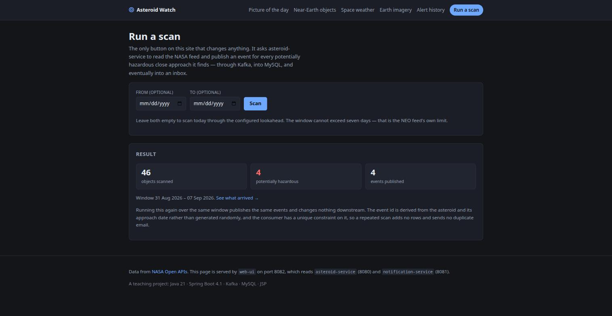

*The only button on the site that changes anything. It asks `asteroid-service` to read
the NASA feed and publish an event for every hazardous close approach — through Kafka,
into MySQL, and eventually into an inbox. Press it twice and the second run publishes
the same events and changes nothing downstream: the event id is derived from the
asteroid plus its approach date rather than generated randomly, and the consumer has a
unique constraint on it.*

### See what arrived

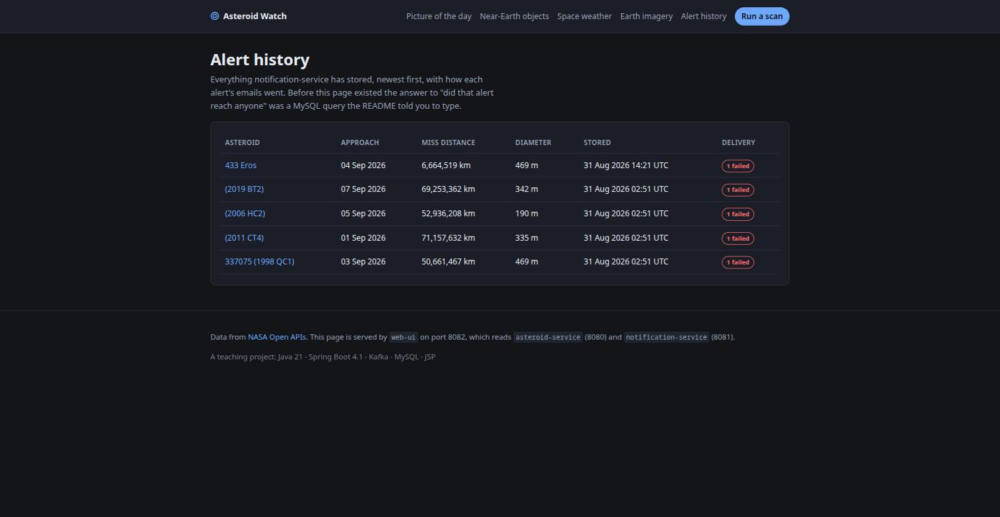

*What `notification-service` stored, newest first. Before this page existed, the answer
to "did that alert reach anyone" was a MySQL query the README told you to type. The
delivery badges roll up one row per recipient, so an alert with failures looks
different from one that went out cleanly without having to open it.*

### Why an email did or did not arrive

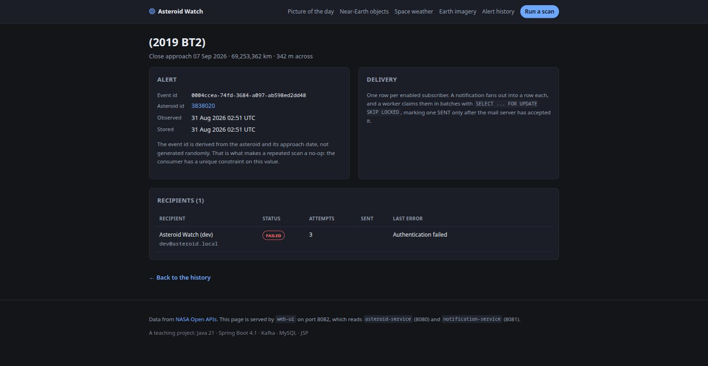

*One row per enabled subscriber, with status, attempt count and the exact error the
mail server returned. This one says `Authentication failed` because the SMTP
credentials in `.env` are wrong — which is the honest thing for it to say. That
`LAST ERROR` column is text from a third party, stored in our database and rendered
into HTML, so it goes through `<c:out>`; JSP's `${...}` does not escape.*

---

## The NASA data

Five APIs, all read through `asteroid-service`.

### Near-Earth objects

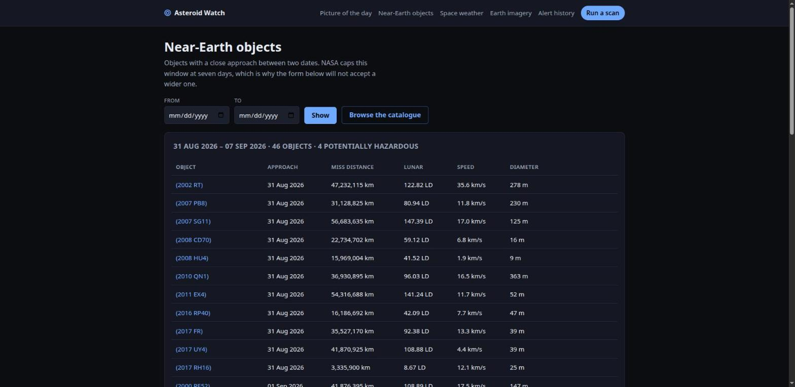

*A window of the feed, capped at seven days — NASA's limit, not ours, which is why the
date form refuses a wider range. Distances appear in kilometres and in **lunar
distances**, because "122 LD" is something you can picture and "47,232,115 km" is not.
All formatting happens in Java: JSTL's `<fmt:formatDate>` predates `java.time` and
fails at render time on a `LocalDate`.*

### One object, in full

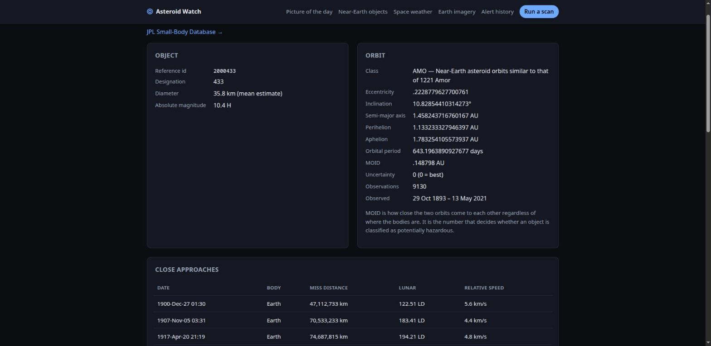

*Orbital data appears only on the lookup and browse endpoints — the feed omits it to
keep its payload small — so one `Asteroid` record covers all three and this field is
null for feed results. Every orbital element stays a `String`, exactly as NASA sends
it: parsing twenty decimals to render them back as text buys nothing and turns one
malformed field into a failed response. The close-approach table includes passes to
Mercury, Venus and Mars, which the feed never returns.*

### The whole catalogue

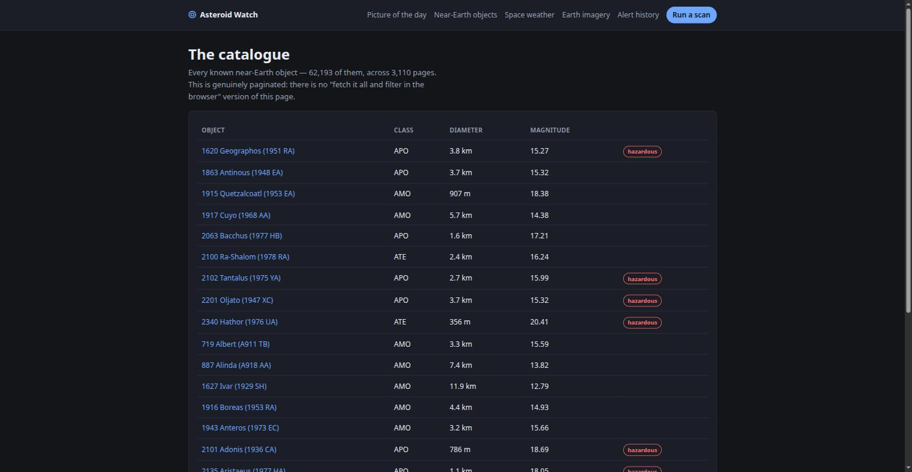

*62,193 objects across 3,110 pages. Genuinely paginated — there is no "fetch it all and
filter in the browser" version of this page.*

### Picture of the day

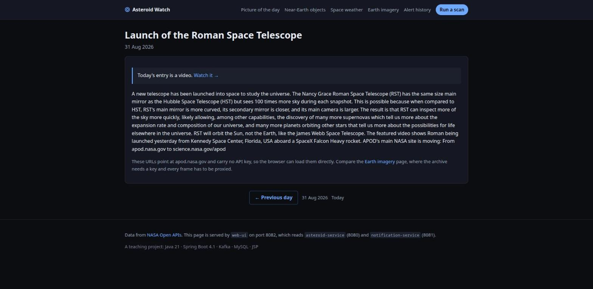

*Captured on a video day, which is the interesting case: `url` is a YouTube embed and
`hdurl` is absent entirely. Note the grey paragraph at the bottom — APOD's URLs point
at `apod.nasa.gov` and carry no API key, so a browser can load them directly. That is
**not** true of the next page, and the contrast is the lesson.*

### Earth imagery

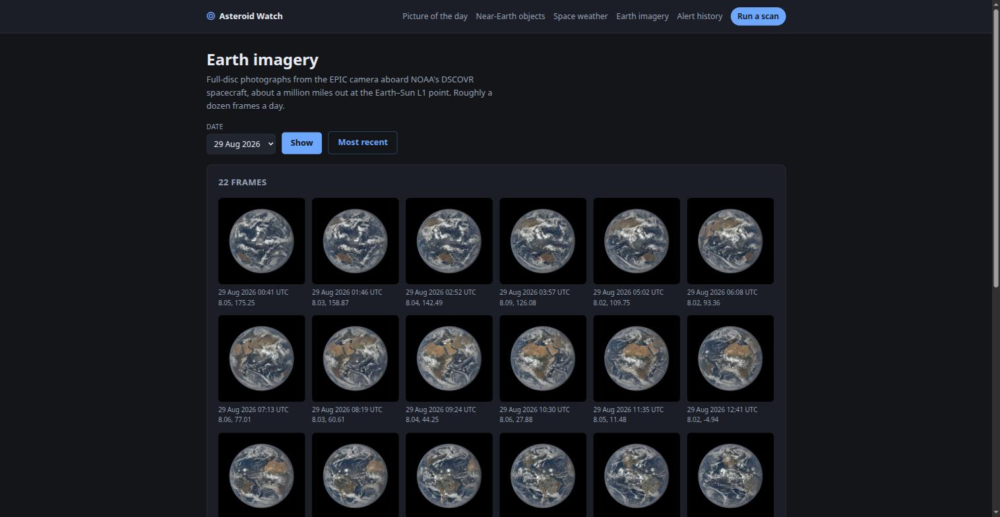

*Full-disc photographs from the EPIC camera aboard DSCOVR, about a million miles out.
NASA's EPIC archive requires the API key as a query parameter, so an archive URL can
never be written into a page — it would publish the credential to every browser, proxy
and history file that saw it. `asteroid-service` fetches the bytes server-side and
hands out a key-free path; `web-ui` proxies that again so the browser only ever talks
to one origin. View the source of this page: there is no `api_key` anywhere in it.*

### Space weather

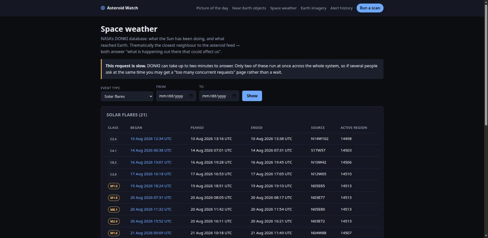

*NASA's DONKI database — solar flares, coronal mass ejections and geomagnetic storms.
The warning banner is not decoration: a DONKI query genuinely takes 60–90 seconds, so
`asteroid-service` gives it a 120-second read timeout, its own circuit breaker, and a
bulkhead capping it at two concurrent calls. Flare class is logarithmic — an X is ten
times an M — so the badges are coloured by letter.*

### When a backend is down

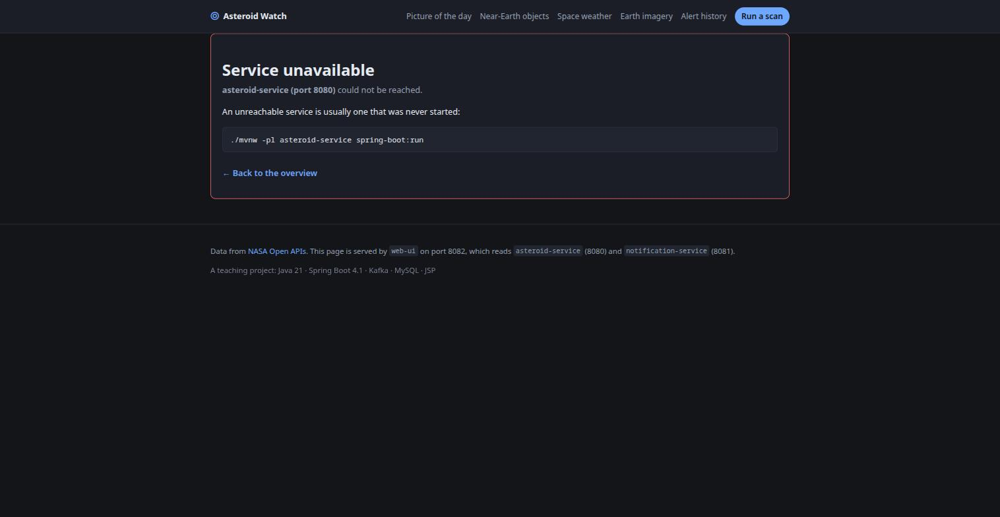

*Both backends answer failures with RFC 9457 `application/problem+json`, which is right
for an API and useless in a browser. `web-ui` decodes it and renders the title and
detail the backend wrote — so "The NASA feed is failing repeatedly and calls are being
shed" reaches a person in the words of the service that knew it. An unreachable service
is nearly always one that was never started, so the page says how to start it.*

---

## Layout

```
.
├── contracts/              shared Kafka event contract (plain jar, no Spring)
├── asteroid-service/       NASA APIs -> Kafka        (port 8080)
├── notification-service/   Kafka -> MySQL -> email   (port 8081)
├── web-ui/                 JSP front end (war)       (port 8082)
├── docs/                   bilingual teaching material
└── docker-compose.yml      MySQL, Kafka (KRaft), Kafka UI
```

A Maven multi-module build. `contracts` holds the one definition of
`AsteroidCollisionEvent` that both services depend on, so the event schema cannot drift
between producer and consumer. `web-ui` deliberately does *not* depend on it — see
[Architecture](docs/en/01-architecture.md).

## Running it

**1. Configure.**

```bash
cp .env.example .env
```

| Variable | Notes |
|---|---|
| `NASA_API_KEY` | Free key from [api.nasa.gov](https://api.nasa.gov). **Do not leave it as `DEMO_KEY`** — that is capped at 30 requests/hour across *every* endpoint, and one page load spends four. A real key gives 10,000/hour |
| `MYSQL_ROOT_PASSWORD`, `MYSQL_USER`, `MYSQL_PASSWORD` | Any values; compose and the app read the same ones |
| `MAIL_USERNAME`, `MAIL_PASSWORD` | SMTP credentials — [Mailtrap](https://mailtrap.io) sandbox by default |

`.env` is git-ignored. Do not commit it.

**2. Start the infrastructure.**

```bash
docker compose up -d
docker compose ps          # wait for mysql and kafka to report healthy
```

**3. Build and run all three services.**

```bash
./mvnw clean install

set -a; . ./.env; set +a          # export the variables into your shell
./mvnw -pl asteroid-service      spring-boot:run     # terminal 1
./mvnw -pl notification-service  spring-boot:run     # terminal 2
./mvnw -pl web-ui                spring-boot:run     # terminal 3
```

**4. Open <http://localhost:8082>.**

Press **Run a scan**, then look at **Alert history**. Watch the raw messages in Kafka UI
at <http://localhost:8084>, and the emails in your Mailtrap inbox — the delivery worker
picks up pending emails every 30 seconds.

The services start in any order, and `web-ui` runs fine with the other two stopped.

Or drive it from the command line:

```bash
curl -X POST localhost:8080/api/v1/asteroid-alerting/alert
# {"from":"2026-08-31","to":"2026-09-07","scanned":46,"hazardous":4,"published":4}

curl -s localhost:8081/api/v1/notifications/stats
```

## How it works

**Idempotency.** Each scan covers a rolling window, so consecutive scans legitimately
re-report the same approach, and Kafka is at-least-once on top of that. The producer
derives `eventId` from `asteroidId + closeApproachDate` rather than randomly, and the
consumer has a unique constraint on it — so re-scanning adds no rows and sends no
duplicate emails.

**Event contract.** The `__TypeId__` header carries the alias `asteroid-collision.v1`,
not a fully-qualified class name, via `spring.json.type.mapping` on both sides. Either
service can move its packages without stranding messages already in the topic.

**Per-API timeouts.** The five NASA APIs are not comparable: a DONKI query routinely
takes 60–90 seconds while the NEO feed answers in under two. Each gets its own
`RestClient`, timeout budget and Resilience4j instance — so a DONKI outage opens a
circuit that sheds DONKI calls and leaves the NEO feed untouched.

**Caching, which is not optional.** NASA's rate limit is per key, not per endpoint, and
one page load spends several calls. Read-only responses are cached for ten minutes.
The alerting scan deliberately is not: a cached scan would publish events from a window
read minutes ago while reporting them as current.

**The API key never leaves asteroid-service.** It travels as a query parameter, so the
request URI is deliberately kept out of every log line and exception message.

**Delivery.** A notification fans out into one `notification_delivery` row per enabled
subscriber. The worker claims a batch with `SELECT ... FOR UPDATE SKIP LOCKED`, so
multiple instances share the queue rather than double-sending, and marks a row `SENT`
only *after* the mail server accepts the message.

**Failure handling.** Retries and circuit breakers on the NASA side. On the consumer
side, a message that cannot be deserialized is retried with exponential backoff and
then parked on `asteroid-alert.DLT` instead of blocking the partition.

**Schema.** Flyway owns it (`notification-service/src/main/resources/db/migration`),
with `ddl-auto=validate` so a mapping that disagrees with the schema fails at startup.

## Testing

```bash
./mvnw test      # unit and slice tests, no Docker needed
./mvnw verify    # adds the integration tests, needs a running Docker daemon
```

Integration tests spin up real MySQL and Kafka containers via Testcontainers — no
in-memory substitutes, so constraints and `SKIP LOCKED` behave as they will in
production. `AsteroidAlertConsumeIT` covers the consume path end to end, including
idempotent re-delivery and a poison message reaching the dead-letter topic.

`WebUiPagesIT` is the only test that actually compiles the JSPs. `@WebMvcTest` cannot:
a slice has no servlet container, so `MockMvc` reports the forward to
`/WEB-INF/jsp/x.jsp` and stops — a broken taglib URI or a typo in an EL expression
would pass. It also asserts that `<c:out>` really escapes, and that no page contains an
API key.

## Endpoints

| | asteroid-service | notification-service | web-ui |
|---|---|---|---|
| Port | 8080 | 8081 | 8082 |
| Health | `/actuator/health` | `/actuator/health` | `/actuator/health` |
| Metrics | `/actuator/prometheus` | `/actuator/prometheus` | `/actuator/prometheus` |

**asteroid-service**

| | |
|---|---|
| `POST /api/v1/asteroid-alerting/alert?from=&to=` | scan the feed and publish events |
| `GET /api/v1/nasa/apod?date=` | astronomy picture of the day |
| `GET /api/v1/nasa/neo/feed?from=&to=` | close approaches in a window (max 7 days) |
| `GET /api/v1/nasa/neo/{id}` | one object, with its orbit |
| `GET /api/v1/nasa/neo/browse?page=&size=` | the full catalogue, paginated |
| `GET /api/v1/nasa/donki/{cme,gst,flr}?from=&to=` | space weather — **slow, up to 2 minutes** |
| `GET /api/v1/nasa/epic/natural?date=` | Earth imagery metadata |
| `GET /api/v1/nasa/epic/image/{collection}/{y}/{m}/{d}/{image}` | proxied PNG, no API key |

**notification-service**

| | |
|---|---|
| `GET /api/v1/notifications?page=&size=` | stored alerts, newest first |
| `GET /api/v1/notifications/{eventId}` | one alert with per-recipient delivery status |
| `GET /api/v1/notifications/stats` | pipeline totals |

## Troubleshooting

**Everything NASA-related returns 503, or the UI is all error pages.** Almost always
the rate limit — `DEMO_KEY` is 30 requests/hour across *all* endpoints. Get your own
key.

**Space weather takes forever.** It is meant to. DONKI also returns transient 503s that
succeed on retry. If you get a 429 instead, the bulkhead is working — only two of those
run concurrently.

**`notification-service` health is DOWN.** Usually the mail indicator with unset or
wrong SMTP credentials. `/actuator/health/readiness` stays UP — mail is reported
honestly without taking the service out of rotation.

**No emails arrive.** Open <http://localhost:8082/history>, which shows `status` and
`last_error` per recipient.

More, including what to do when a JSP change does not appear, in
[Running locally](docs/en/10-running-locally.md).
