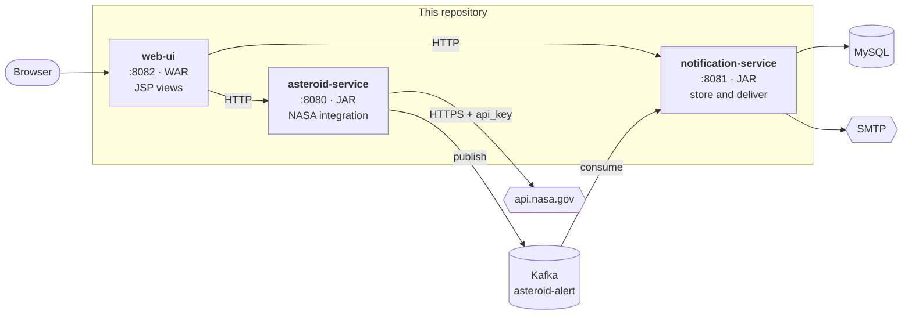

[← Overview](00-overview.md) · **English** · [Português (Brasil)](../pt-BR/01-architecture.md)

# Architecture



Note the direction of every arrow: nothing points backwards. `web-ui` reads the other
two and neither knows it exists; `asteroid-service` publishes to Kafka and does not
know who consumes; `notification-service` never calls NASA. Each service can be
stopped without the others failing to start.

## Why three services instead of one

Because they have different reasons to change and different ways to fail.

`asteroid-service` fails when NASA is slow, rate-limiting, or has changed a field
name. `notification-service` fails when the database is unavailable or an SMTP server
rejects a recipient. Those failures have nothing to do with each other, and in one
process they would share a thread pool, a heap and a deployment.

The event log between them is what makes that real rather than cosmetic. If
`notification-service` is down for an hour, `asteroid-service` keeps scanning and
publishing; the messages wait in the topic and are processed when the consumer comes
back. That is a property you cannot get from an HTTP call between two modules of the
same application.

## Why `web-ui` is a separate module

This is the decision most worth explaining, because "just add the JSPs to
asteroid-service" is the obvious alternative.

**Error handling is incompatible.** `asteroid-service` has a `@RestControllerAdvice`
that turns failures into `application/problem+json`. That is exactly right for an API
and useless in a browser. A view layer in the same context would inherit it, and a
failing page would return a JSON document. `web-ui` has a plain `@ControllerAdvice`
that renders `error.jsp` — and, usefully, one that *decodes* the backends'
`problem+json` and shows the title and detail they wrote. See `ViewExceptionHandler`.

**Packaging is incompatible.** JSP requires WAR packaging; Spring Boot's executable
JAR layout cannot serve JSPs at all. Making `asteroid-service` a WAR to gain a view
layer would change how the producer is built and deployed for a reason that has
nothing to do with producing.

**The lifecycles differ.** The front end changes when someone wants a different page.
The producer changes when NASA changes. Keeping them apart means a CSS tweak cannot
break the alerting pipeline.

The cost is real and worth stating: `web-ui` duplicates the view models of both
backends in `com.arthur.asteroid.webui.backend.dto`, so a field removed upstream shows
up here as a null rather than a compile error. `WebUiPagesIT` is what catches that.
The `package-info.java` in that package explains why the alternatives are worse.

## Why `contracts` exists — and why `web-ui` does not use it

`contracts` holds exactly one record, `AsteroidCollisionEvent`, plus the alias
constant for it. Both `asteroid-service` and `notification-service` depend on it, so
the event schema cannot drift between producer and consumer: change the record and
both sides stop compiling, which is the point.

It is deliberately dependency-light — Jackson annotations and Bean Validation
annotations, no Spring, no Lombok — and has no `<build>` section, so
`spring-boot-maven-plugin` never turns it into an unusable fat JAR.

`web-ui` does **not** depend on it, and that is deliberate. `contracts` is the *Kafka
wire contract*. Putting HTTP view models in it would couple the event schema to the
web layer and give both services a reason to change a module whose whole value is
that it rarely changes. `web-ui` talks to its backends over HTTP and JSON like any
other client would.

## The shape of a request

Two paths through the system, worth following once each.

**Reading** — `GET /neo` on `web-ui`:

1. `NeoController` calls `AsteroidServiceClient.neoFeed(...)`.
2. That goes over HTTP to `asteroid-service`'s `NeoCatalogController`.
3. Which calls `RestNasaNeoClient.findAsteroids(...)` — retried, circuit-broken, on
   its own timeout budget.
4. Which calls `api.nasa.gov` with the API key attached.
5. The response comes back as records, is rendered by `neo-feed.jsp`, and reaches the
   browser as HTML.

Four hops. If NASA is rate-limiting, step 4 throws `NasaUnavailableException`, step 3
turns it into a 503 `problem+json`, step 2 turns that into a
`BackendUnavailableException` carrying NASA's own explanation, and step 1 renders a
page that says which service failed and what to do about it.

**Writing** — `POST /scan`:

1. `ScanController` posts to `asteroid-service`.
2. `AsteroidAlertingService` reads the feed, filters to hazardous objects, and derives
   a **deterministic** event id from asteroid + approach date.
3. `AsteroidEventPublisher` publishes one event per approach, keyed by asteroid id.
4. `notification-service`'s `AsteroidAlertListener` consumes, and
   `NotificationIngestService` stores it — short-circuiting if the event id already
   exists.
5. A scheduled worker claims pending deliveries and sends the email.

Step 2 and step 4 together are why running a scan twice is harmless. That is
[document 04](04-event-driven-kafka.md).

## Ports

| Service | Port | What it is |
|---|---|---|
| `asteroid-service` | 8080 | NASA integration + producer |
| `notification-service` | 8081 | consumer + store + email |
| `web-ui` | 8082 | JSP front end |
| MySQL | 3306 | `notification-service`'s database |
| Kafka | 9092 | the event log |
| Kafka UI | 8084 | browse topics and messages |

## Try it yourself

Watch a request cross every boundary. With all three services running:

```bash
# hit web-ui and see it call asteroid-service, which calls NASA
curl -s localhost:8082/neo | grep -o "<title>.*</title>"

# the same data, one hop in
curl -s "localhost:8080/api/v1/nasa/neo/feed" | head -c 200

# now stop notification-service and reload the home page:
# the pipeline card greys out, the NASA cards still render
curl -s localhost:8082/ | grep -c "unavailable"
```
