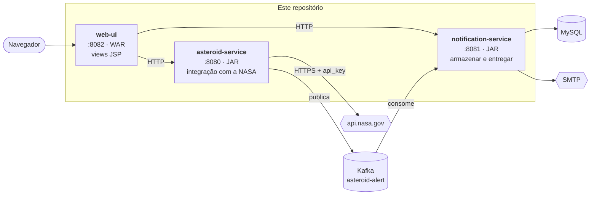

[← Visão geral](00-overview.md) · [English](../en/01-architecture.md) · **Português (Brasil)**

# Arquitetura



Repare na direção de cada seta: nenhuma aponta para trás. O `web-ui` lê os outros dois
e nenhum deles sabe que ele existe; o `asteroid-service` publica no Kafka e não sabe
quem consome; o `notification-service` nunca chama a NASA. Cada serviço pode ser
parado sem impedir que os outros iniciem.

## Por que três serviços em vez de um

Porque eles têm motivos diferentes para mudar e formas diferentes de falhar.

O `asteroid-service` falha quando a NASA está lenta, limitando requisições ou mudou o
nome de um campo. O `notification-service` falha quando o banco está indisponível ou um
servidor SMTP rejeita um destinatário. Essas falhas não têm nada a ver uma com a outra,
e em um único processo elas compartilhariam pool de threads, heap e implantação.

O log de eventos entre os dois é o que torna isso real e não cosmético. Se o
`notification-service` ficar fora por uma hora, o `asteroid-service` continua varrendo
e publicando; as mensagens esperam no tópico e são processadas quando o consumidor
volta. Essa é uma propriedade que você não obtém de uma chamada HTTP entre dois módulos
da mesma aplicação.

## Por que o `web-ui` é um módulo separado

Esta é a decisão que mais merece explicação, porque "é só colocar os JSPs dentro do
asteroid-service" é a alternativa óbvia.

**O tratamento de erros é incompatível.** Aquele serviço tem um
`@RestControllerAdvice` que transforma falhas em `application/problem+json`. Isso é
exatamente certo para uma API e inútil em um navegador. Uma camada de view no mesmo
contexto herdaria esse comportamento, e uma página com erro devolveria um documento
JSON. O `web-ui` tem um `@ControllerAdvice` comum que renderiza `error.jsp` — e, o que é
mais útil, que *decodifica* o `problem+json` dos backends e mostra o título e o detalhe
que eles escreveram. Veja `ViewExceptionHandler`.

**O empacotamento é incompatível.** JSP exige empacotamento WAR; o layout de JAR
executável do Spring Boot não consegue servir JSPs. Tornar o `asteroid-service` um WAR
para ganhar uma camada de view mudaria como o produtor é construído e implantado por um
motivo que não tem nada a ver com produzir eventos.

**Os ciclos de vida são diferentes.** O front-end muda quando alguém quer uma página
diferente. O produtor muda quando a NASA muda. Mantê-los separados significa que um
ajuste de CSS não pode quebrar o pipeline de alertas.

O custo é real e vale declarar: o `web-ui` duplica os modelos de leitura dos dois
backends em `com.arthur.asteroid.webui.backend.dto`, então um campo removido lá em cima
aparece aqui como `null` em vez de erro de compilação. O `WebUiPagesIT` é o que pega
isso. O `package-info.java` daquele pacote explica por que as alternativas são piores.

## Por que o `contracts` existe — e por que o `web-ui` não o usa

O `contracts` tem exatamente um record, `AsteroidCollisionEvent`, mais a constante do
alias. Tanto o `asteroid-service` quanto o `notification-service` dependem dele, de modo
que o esquema do evento não pode divergir entre produtor e consumidor: mude o record e
os dois lados param de compilar, que é justamente o objetivo.

É deliberadamente leve em dependências — anotações do Jackson e do Bean Validation, sem
Spring, sem Lombok — e não tem seção `<build>`, para que o `spring-boot-maven-plugin`
nunca o transforme em um fat JAR inutilizável.

O `web-ui` **não** depende dele, e isso é intencional. O `contracts` é o *contrato de
transporte do Kafka*. Colocar modelos de view HTTP nele acoplaria o esquema do evento à
camada web e daria a ambos os serviços um motivo para mudar um módulo cujo valor
principal é raramente mudar. O `web-ui` conversa com seus backends por HTTP e JSON como
qualquer outro cliente faria.

## O formato de uma requisição

Dois caminhos pelo sistema, que vale percorrer uma vez cada.

**Leitura** — `GET /neo` no `web-ui`:

1. `NeoController` chama `AsteroidServiceClient.neoFeed(...)`.
2. Isso vai por HTTP até o `NeoCatalogController` do `asteroid-service`.
3. Que chama `RestNasaNeoClient.findAsteroids(...)` — com retentativa, circuit breaker e
   seu próprio orçamento de timeout.
4. Que chama `api.nasa.gov` com a chave de API anexada.
5. A resposta volta como records, é renderizada por `neo-feed.jsp` e chega ao navegador
   como HTML.

Quatro saltos. Se a NASA estiver limitando requisições, o passo 4 lança
`NasaUnavailableException`, o passo 3 transforma isso em um 503 `problem+json`, o passo
2 transforma aquilo em `BackendUnavailableException` carregando a explicação da própria
NASA, e o passo 1 renderiza uma página que diz qual serviço falhou e o que fazer.

**Escrita** — `POST /scan`:

1. `ScanController` faz POST no `asteroid-service`.
2. `AsteroidAlertingService` lê o feed, filtra os objetos perigosos e deriva um id de
   evento **determinístico** a partir do asteroide + data de aproximação.
3. `AsteroidEventPublisher` publica um evento por aproximação, com chave no id do
   asteroide.
4. O `AsteroidAlertListener` do `notification-service` consome, e o
   `NotificationIngestService` armazena — encerrando cedo se o id do evento já existir.
5. Um worker agendado reivindica as entregas pendentes e envia o e-mail.

Os passos 2 e 4, juntos, são o motivo de rodar uma varredura duas vezes ser inofensivo.
Isso é o [documento 04](04-event-driven-kafka.md).

## Portas

| Serviço | Porta | O que é |
|---|---|---|
| `asteroid-service` | 8080 | integração com a NASA + produtor |
| `notification-service` | 8081 | consumidor + armazenamento + e-mail |
| `web-ui` | 8082 | front-end JSP |
| MySQL | 3306 | banco do `notification-service` |
| Kafka | 9092 | o log de eventos |
| Kafka UI | 8084 | navegar tópicos e mensagens |

## Experimente

Acompanhe uma requisição cruzando todas as fronteiras. Com os três serviços no ar:

```bash
# chama o web-ui, que chama o asteroid-service, que chama a NASA
curl -s localhost:8082/neo | grep -o "<title>.*</title>"

# os mesmos dados, um salto adiante
curl -s "localhost:8080/api/v1/nasa/neo/feed" | head -c 200

# agora pare o notification-service e recarregue a home:
# o cartão do pipeline fica cinza, os cartões da NASA continuam renderizando
curl -s localhost:8082/ | grep -c "unavailable"
```
